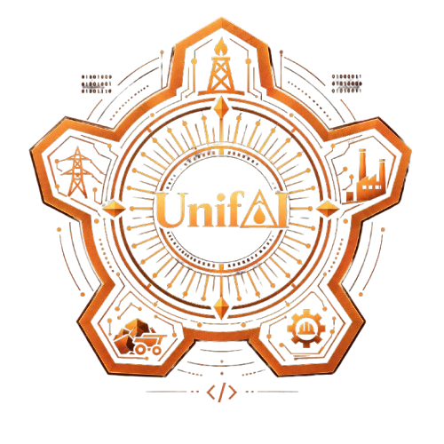

## UnifAI

#### AI-Driven Standardization and Harmonization of Material Codes Across CPSEs

**UnifAI** is an AI-powered platform for standardizing and harmonizing material data across CPSEs using smart automation, machine learning and natural language processing, aiding in detecting duplicate and near-equivalent materials, standardizing descriptions and specifications, classify materials, and recommend a common code. With CPSE code mapping, legacy migration, logging, validation workflows, and ERP integration, UnifAI enables unified material visibility and smarter, more efficient procurement.

*Target Sectors:* Oil & Gas, Power, Steel, Mining, and Heavy Engineering  

---

