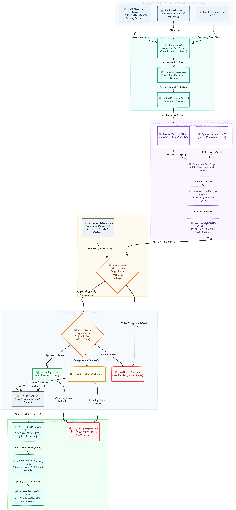

## UnifAI

#### AI-Driven Standardization and Harmonization of Material Codes Across CPSEs

**UnifAI** is an AI-powered platform for standardizing and harmonizing material data across CPSEs using ml and nlp. It helps in automating detection of duplicate and near-equivalent materials, standardizing descriptions and specifications, classify materials, and recommend a common code. With CPSE code mapping, legacy migration, logging, validation workflows, and ERP integration, UnifAI enables unified material visibility and smarter, more efficient procurement.

*Target Sectors:* Oil & Gas, Power, Steel, Mining, and Heavy Engineering

---

## Problem Statement

Central Public Sector Enterprises (CPSEs) operate in isolated master data silos, assigning divergent proprietary codes and unstructured descriptions to identical engineering items. This fragmentation locks over ₹15,000 Crore in dead working capital across redundant, slow-moving MRO buffer inventories and imposes a 15–35% annual carrying cost penalty. Fragmented tendering forfeits bulk demand aggregation—incurring a 5–15% procurement cost premium—while emergency replenishment stretches into 9-month foreign import lead times for critical spares already sitting idle in neighboring sister CPSE warehouses. Crucially, cosmetic text matching risks catastrophic false substitutions (e.g., ANSI Class 150 vs Class 300, SS304 vs SS316), threatening fatal plant blowouts, toxic leaks, and severe downtime across national energy and industrial assets.

--- 

## Objectives

* Automate the standardization and harmonization of material codes across CPSEs
* Identify duplicate, near-duplicate, and functionally equivalent materials across heterogeneous catalogs
* Generate deterministic Common National Material Code (CNMC) recommendations while preserving legacy ERP traceability
* Provide a human-in-the-loop governance workflow with attribute-level explainability and audit tracking
* Audit Log
* Enable seamless ERP interoperability and pre-creation duplicate prevention

---

## Background Study

The development of unifAI was guided by:
* Analysis of Data Sources:
  * Multi-Sector CPSE Corpus (23,457 records): Oil & Gas, Power, Mining, Steel, and Heavy Engineering procurement data.
  * National Procurement Portals: CPPP, GeM, and Indian Railways/IREPS commodity directories.
  * ERP Systems: SAP ECC/S4HANA, Oracle Fusion, and IBM Maximo master schemas.
  * Standards & Taxonomies: BIS, UNSPSC, ISO 14224, and international engineering standard crosswalks.
* Review of research literature related to contrastive representation learning, entity resolution in enterprise ERPs, and automated taxonomy classification.

---

## Key Features

* **Neuro-Symbolic Matching**: Combines semantic embeddings with deterministic engineering rule filters for high recall and zero false merges.
* **Deterministic Safety Gates**: Hard validation on critical technical parameters (pressure class, metallurgy, dimensions) to avoid safety hazards.
* **Non-Destructive Mapping**: Retains native CPSE part numbers through relational crosswalks without breaking legacy records.
* **Tiered Human-in-the-Loop Governance**: Confidence-based automated routing with side-by-side attribute explainability for cataloguers and auditors for vigilance.

---

## System Workflow

---

## Tech Stack

- **Frontend**: React + TypeScript + TailwindCSS.
- **Backend**: FastAPI + Python
- **Database & Vector Storage**: PostgreSQL with pgvector HNSW indexing and halfvec 16-bit quantization.
- **ML & NLP Engine**: LightGBM, sentence-transformers (all-MiniLM-L6-v2 / bge-small), RapidFuzz token matching.
- **Enterprise ERP Reference**: SAP RFC/BAPI (BAPI_MATERIAL_SAVEDATA), MATMAS05 IDocs, S/4HANA OData, and Oracle/Maximo CSV exports.
- **Deployment**: Sovereign, containerized Docker microservices deployable on air-gapped CPSE intranets.

---

## Team
Developed by **Team Alchemists** as a part of SIH'2026.