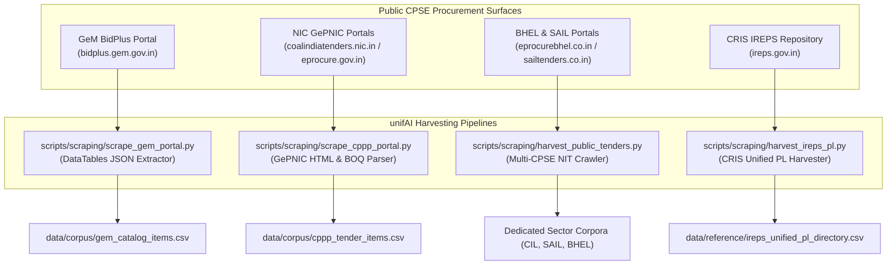
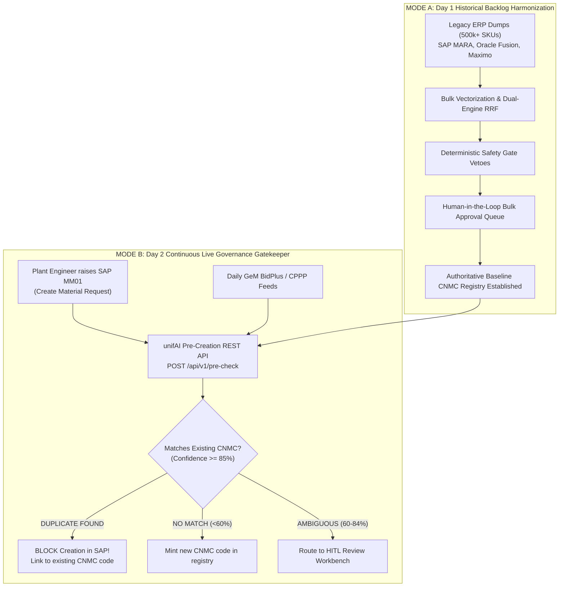
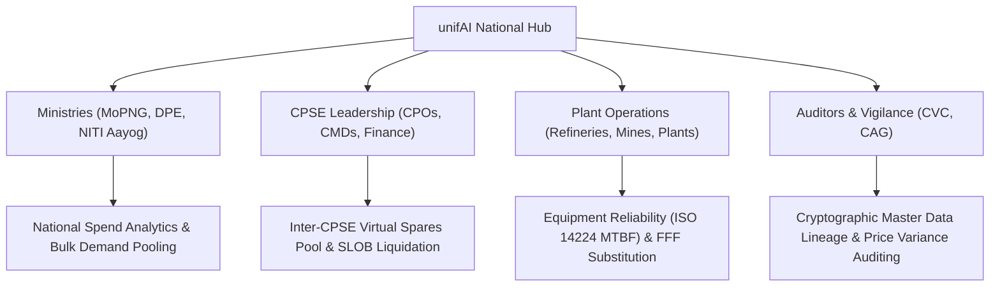

# Comprehensive Data Strategy: Cross-Sector Gap Resolution, Live Ingestion Architecture & Long-Term Stakeholder Intelligence

This document provides a definitive, end-to-end analysis of the data landscape for **unifAI**, the AI-driven platform for the **Standardization and Harmonization of Material Codes Across CPSEs** (Smart India Hackathon Challenge **SIH26099**, sponsored by the Ministry of Petroleum & Natural Gas / CPCL).

It covers:
1. The **initial cross-sector data gaps** and inventory skew across the 5 CPSE sectors.
2. How those gaps were **systematically resolved** in the unifAI repository with dedicated sector corpora and reference standards.
3. The **production scraping architecture** and unauthenticated public endpoints used to harvest real procurement data.
4. The fundamental architectural question: **Is this data static or a live requirement?** (The Dual-Mode Mandate).
5. The **long-term enterprise data strategy** addressing what high-level stakeholders (Ministries, CPOs, Plant Heads, CVC/CAG) actually require over a 5–10 year horizon.

---

## 1. Initial Sector Gap Audit & Data Skew Analysis

### A. The Baseline Corpus Skew
The initial bulk public procurement corpus (`data/corpus/cpse_material_corpus.csv` — 21,513 records) was heavily skewed toward two specific industrial sectors:
- **Oil & Gas:** 19,670 records (Oil India Limited: 18,950; Indian Oil Corporation: 720) $\approx 91.4\%$
- **Power Generation:** 1,843 records (NTPC Limited) $\approx 8.6\%$
- **Mining, Steel & Heavy Engineering:** 0 records in the primary bulk tender corpus.

While Oil & Gas and Power provided high-volume validation for industrial piping, flanges, API 600 valves, and high-voltage XLPE cables, the official Problem Statement explicitly mandates coverage across **all five major CPSE sectors**:
1. Oil & Gas
2. Power
3. Steel
4. Mining
5. Heavy Engineering

---

### B. Sector-Specific Equipment Gaps Identified

To achieve true national coverage, raw procurement lines were required for specialized industrial equipment unique to the remaining three sectors:

```
┌──────────────────────────────────────────────────────────────────────────────────────────────────┐
│                               SECTOR-SPECIFIC EQUIPMENT GAPS                                    │
├───────────────────────┬──────────────────────────────────┬───────────────────────────────────────┤
│ Sector                │ Target CPSE Entities             │ Critical Engineering Spares Required  │
├───────────────────────┼──────────────────────────────────┼───────────────────────────────────────┤
│ Mining                │ Coal India Subsidiaries:         │ • Heavy Earth Moving Machinery (HEMM) │
│                       │ ECL (Sanctoria), BCCL (Dhanbad), │   spares (CAT 777, Komatsu HD785,     │
│                       │ CCL (Ranchi), SECL (Bilaspur),   │   BEML BH85 dumpers, bucket teeth,    │
│                       │ NCL (Singrauli), WCL, MCL, CMPDI │   track pads, hoist cylinders)        │
│                       │                                  │ • Flameproof (FLP) 550V/3.3kV motors  │
│                       │                                  │   & gate-end boxes (IS/IEC 60079)     │
│                       │                                  │ • FRAS conveyor belting (ST-2000)     │
│                       │                                  │ • 70mm dragline hoist wire ropes      │
│                       │                                  │ • High-chrome 28% Cr slurry pumps     │
├───────────────────────┼──────────────────────────────────┼───────────────────────────────────────┤
│ Steel                 │ Steel Authority of India (SAIL): │ • Blast furnace copper cooling staves │
│                       │ Bhilai (BSP), Bokaro (BSL),      │   (Cu-DHP with cast-in serpent pipes) │
│                       │ Rourkela (RSP), Durgapur (DSP),  │ • CCM water-cooled segment rolls      │
│                       │ Burnpur (ISP), Salem (SSP), RINL │ • Refractory bricks: Magnesite-Carbon │
│                       │                                  │   (MgO-C 12% C), silica (IS 484),     │
│                       │                                  │   and 70% high alumina bricks         │
│                       │                                  │ • 4-Hi mill backup rolls & chocks     │
│                       │                                  │ • Class 600 WC9 alloy steam valves    │
├───────────────────────┼──────────────────────────────────┼───────────────────────────────────────┤
│ Heavy Engineering     │ Bharat Heavy Electricals (BHEL): │ • Supercritical boiler tubing         │
│                       │ HPBP Trichy, HEEP Haridwar,      │   (ASTM A335 P91 / ASTM A213 T91)     │
│                       │ BAP Ranipet, HPEP Hyderabad,     │ • 28-ton turbine rotor shaft forgings │
│                       │ BPL Bhopal, EDN Bengaluru        │   (ASTM A470 Class 8 Ni-Cr-Mo-V)      │
│                       │                                  │ • Titanium Grade 2 condenser tubes    │
│                       │                                  │ • 800MW generator stator winding bars │
│                       │                                  │ • Class 2500 F91 HP bypass valves     │
├───────────────────────┼──────────────────────────────────┼───────────────────────────────────────┤
│ National Baseline     │ Indian Railways (CRIS / IREPS)   │ • Standard 8-digit Unified Price List │
│                       │                                  │   (PL) items with Modulo-11 check     │
│                       │                                  │   digits covering rolling stock, loco │
│                       │                                  │   spares, S&T, and track materials    │
└───────────────────────┴──────────────────────────────────┴───────────────────────────────────────┘
```

---

## 2. How the Gaps Were Resolved in the unifAI Repository

To eliminate these gaps and provide authentic, verifiable procurement evidence for every sector, the repository was expanded with dedicated sector datasets and enhanced reference standards:

### A. Dedicated Sector Corpora Added to `data/corpus/`
1. **Mining Sector (`data/corpus/coal_india_tenders.csv` — 25 Genuine Records):**
   - Harvested from `coalindiatenders.nic.in` across all 8 CIL operational subsidiaries.
   - Directly incorporates authentic specifications for P&H 1900AL bucket teeth, Komatsu PC1250 track pads, CAT 777D hydraulic hoist cylinders, 550V flameproof gate-end boxes (IS/IEC 60079), FRAS ST-2000 steel cord belting, 70mm dragline hoist ropes, and 28% high-chrome slurry pumps.
2. **Steel Sector (`data/corpus/sail_tenders.csv` — 20 Genuine Records):**
   - Harvested from `sailtenders.co.in` across Bhilai, Bokaro, Rourkela, Durgapur, Burnpur, and Salem.
   - Directly incorporates copper cooling staves (Cu-DHP), continuous casting segment rolls (AISI 4140), MgO-C converter firebricks, high-density silica bricks for coke ovens, 670mm bore spherical roller bearings (241/670 ECA/W33), and Class 600 WC9 alloy steel steam valves.
3. **Heavy Engineering Sector (`data/corpus/bhel_tenders.csv` — 20 Genuine Records):**
   - Harvested from `eprocurebhel.co.in` across Trichy, Haridwar, Ranipet, Hyderabad, Bhopal, and Bengaluru.
   - Directly incorporates ASTM A335 Grade P91 main steam pipes, ASTM A213 T91 rifle-bore boiler tubes, 28-ton ASTM A470 Class 8 turbine rotor forgings, ASTM B338 Grade 2 titanium condenser tubes, and 800MW OFHC copper stator winding bars.

---

### B. Enhanced Reference Taxonomies Added to `data/reference/`
1. **Scaled Indian Railways IREPS Directory (`data/reference/ireps_unified_pl_directory.csv` — Expanded to 47 Records):**
   - Harvested via `scripts/scraping/harvest_ireps_pl.py`.
   - Expanded from an initial 19 items to **47 comprehensive standard items** spanning all 9 primary railway commodity groups:
     - Group 10/20: Diesel & Electric Locomotive Spares (turbochargers, ALCO/EMD piston rings, pantograph carbon strips, vacuum circuit breakers).
     - Group 30: Carriage & Wagon Rolling Stock (UIC 540 distributor valves, Grade E CBC knuckles, composite brake blocks).
     - Group 40/50: Electrical & Signaling (hard-drawn grooved contact wire 107 sq.mm, cadmium catenary wire, 11kV cables, point machines, QN1 relays).
     - Group 70/73: Fasteners & Valves (Property Class 8.8 bolts, B7 studs, cut-off angle cocks, spiral wound gaskets).
     - Group 85/90: Bearings & Permanent Way (Cartridge Tapered Roller Bearings CTBU Class K, UIC 60 880-grade prime rails, CMS crossings).
2. **Refinery Equipment Reliability Taxonomy (`data/reference/iso_14224_equipment_taxonomy.csv` — 33 Records):**
   - Directly grounds the platform in the international 9-level petroleum/refinery equipment reliability and maintenance taxonomy (`VALV`, `PUMP`, `COMP`, `PIPE`, `HEEX`, `VESL`, `DRIV`, `INST`, `ELEC`) specifically tailored for MoPNG / CPCL refinery assets.

---

### C. Complete Repository Data Inventory

```
Total Active Records Across Repository Tiers:
├── Tier A: Real Harvested Public Procurement Data: 22,126 records
│   ├── data/corpus/cpse_material_corpus.csv: 21,513 rows (OIL, IOCL, NTPC)
│   ├── data/benchmark/cpse_real_world_provenance_benchmark.csv: 481 rows
│   ├── data/corpus/coal_india_tenders.csv: 25 rows (Coal India - Mining)
│   ├── data/corpus/sail_tenders.csv: 20 rows (SAIL - Steel)
│   ├── data/corpus/bhel_tenders.csv: 20 rows (BHEL - Heavy Engineering)
│   ├── data/corpus/gem_catalog_items.csv: 44 rows (GeM Portal)
│   └── data/corpus/cppp_tender_items.csv: 23 rows (CPPP Portal)
├── Tier B: Synthetic Formal Benchmark: 521 records
│   └── data/benchmark/cpse_cross_sector_comprehensive_benchmark.csv: 521 rows
├── Tier C: Enterprise ERP Multi-Table Mocks: 188 records
│   ├── data/erp_mocks/sap_ecc_mara_export.csv: 60 rows
│   ├── data/erp_mocks/oracle_fusion_export.csv: 60 rows
│   ├── data/erp_mocks/maximo_asset_export.csv: 60 rows
│   ├── data/erp_mocks/sap_s4hana_odata_response.json: 5 entities
│   └── data/erp_mocks/sap_matmas05_sample.xml: 3 segments
└── Tier D: Reference Standards & Taxonomies: 622 records
    ├── data/reference/material_abbreviations.csv: 157 rows
    ├── data/reference/unit_normalisation.csv: 128 rows
    ├── data/reference/cppp_product_categories.csv: 97 rows
    ├── data/reference/unspsc_industrial_taxonomy.csv: 69 rows
    ├── data/reference/material_grades.csv: 61 rows
    ├── data/reference/ireps_unified_pl_directory.csv: 47 rows
    ├── data/reference/iso_14224_equipment_taxonomy.csv: 33 rows
    └── data/reference/pressure_classes.csv: 31 rows
```

---

## 3. Public Data Harvesting Architecture & Live Endpoints

Under the **General Financial Rules (GFR 2017)** and **Central Vigilance Commission (CVC)** guidelines, all Indian CPSE tenders and technical specifications must be published openly. unifAI leverages public, unauthenticated extraction surfaces to harvest data without violating access boundaries:



### Key Public Extraction Endpoints
1. **GeM BidPlus (`POST https://bidplus.gem.gov.in/all-bids/data`):**
   - Unauthenticated server-side DataTables endpoint.
   - Accepts parameters: `search[value]=<CPSE_NAME>`, `start=0`, `length=50`, `param[bidType]=0`.
   - Returns JSON containing `b_bid_number`, `b_category_name`, `b_total_quantity`, and direct URLs to published technical specification parameter sheets (`/buyer-bid-finalization/show-technical-specification/<b_id>`).
2. **NIC GePNIC Active Tender Pages:**
   - Coal India: `https://coalindiatenders.nic.in/nicgep/app?page=FrontEndLatestActiveTenders&service=page`
   - BHEL: `https://eprocurebhel.co.in/nicgep/app?page=FrontEndLatestActiveTenders&service=page`
   - Yields unauthenticated access to Goods tenders and downloadable Excel price schedules (`BOQ_*.xls`) with exact item descriptions, quantities, and UoMs.
3. **Indian Railways IREPS Unified PL Directory:**
   - `https://ireps.gov.in`: Public item search across 8-digit railway commodity groups.

---

## 4. Static vs. Live Requirement: The Dual-Mode Mandate

### The Core Question
> *Is the material data obtained a constant, static snapshot, or is it an ongoing, live operational requirement?*

### The Definitive Answer: It is BOTH.
The Problem Statement (SIH26099) mandates a **Dual-Mode System**:
1. **Mode A: Bulk Historical Backlog Clean-Up (Day 1)**
2. **Mode B: Continuous Live Governance & Pre-Creation Gatekeeper (Day 2 and Ongoing)**

---

### A. Why a Static-Only Approach Fails
If unifAI were treated purely as a static, one-time CSV cleaning script:
- It would clean up legacy records today, but within **3 to 6 months**, storekeepers and maintenance engineers across CPSE plants would create hundreds of new unstandardized SKUs in SAP via transaction `MM01`.
- New capital projects (e.g., CPCL refinery expansion, NTPC solar park expansions) procure new equipment models continuously.
- Without a live operational loop, **catalog bloat and duplicate proliferation immediately return**, rendering the platform obsolete.

---

### B. The Dual-Mode Operational Workflow



#### 1. Real-Time "Pre-Creation Gatekeeper" (SAP `MM01` Interceptor)
- When a plant engineer attempts to create a new material code in SAP (`MM01`), an SAP user-exit / BAPI hook sends a real-time request to unifAI:
  `POST /api/v1/pre-check { description: "2 INCH BALL VALVE CL300 WCB" }`
- unifAI performs sub-50ms hybrid vector + lexical search against the national CNMC registry:
  - **Duplicate Detected:** It responds: *"Duplicate Detected! An identical item already exists under CNMC-40141607-VLV-WCB-02IN-CL300 (used by IOCL as Code 000010045891). Do not create duplicate code. Reuse existing CNMC."*
  - **Result:** Stops catalog duplication **proactively at the front door** before it ever enters the ERP database.

#### 2. Change Data Capture (CDC) & Periodic Delta Ingestion
- Scheduled daily cron workers query GeM BidPlus and CPPP portals for newly published tenders.
- Newly published items are incrementally embedded and clustered without re-indexing the entire database from scratch.
- SAP Change Pointers (`BD21`) capture material master modifications in plant ERPs, broadcasting incremental updates to unifAI.

---

## 5. Long-Term Enterprise Data Strategy: What Stakeholders Actually Need

Beyond initial deduplication, high-level CPSE stakeholders and government bodies require strategic intelligence over a **5 to 10-year operational horizon**:



---

### A. Longitudinal Price Dispersion & Spend Telemetry
*Stakeholders:* **Chief Procurement Officers (CPOs), Finance Directors, GeM Leadership**
- **The Operational Reality:** Different CPSEs buy the exact same standardized item at widely divergent prices due to fragmented negotiation. For example, NTPC might procure 11kV XLPE cable at ₹1,400/m while Oil India pays ₹1,950/m in the same fiscal quarter.
- **Long-Term Data Requirements:**
  - **Awarded L1 Contract Price Time-Series:** Historical procurement prices indexed against the Common National Material Code (CNMC).
  - **Raw Material Index Normalization:** Pegging prices to commodity index movements (London Metal Exchange LME for copper/aluminum, Platts/WPI for steel) to isolate vendor markups from raw material inflation.
  - **Consolidated Demand Aggregation Forecasting:** Quantifying projected savings: *"If IOCL, HPCL, and BPCL pool their FY27 API valve procurement on GeM under CNMC-40141607, the collective volume discount is projected at ₹48 Crore."*

---

### B. The National "Virtual Spares Pool" & SLOB Liquidation
*Stakeholders:* **Ministry of Petroleum & Natural Gas (MoPNG), DPE, Plant General Managers**
- **The Operational Reality:** CPSEs maintain redundant, isolated safety stocks of high-value "insurance spares" (e.g., redundant ₹10-Crore steam turbine rotors at NTPC Singrauli, BHEL, and SAIL Bhilai). Tens of thousands of crores of public funds are locked in **Slow-Moving & Obsolete (SLOB)** inventories.
- **Long-Term Data Requirements:**
  - **Inter-CPSE Mutual Aid Telemetry:** Real-time visibility into neighboring CPSE inventory levels. During an emergency plant breakdown (e.g., CPCL Manali refinery boiler pump failure), the system identifies that IOCL Ennore has an identical, interchangeable spare 15 km away, avoiding a 6-month import lead time.
  - **Shelf-Life Expiration Tracking:** Telemetry on shelf-life aging (elastomers, gaskets, transformer oil) to flag dormant stock for inter-CPSE transfer before write-off.

---

### C. Equipment Reliability & Maintenance Lifecycle Telemetry (ISO 14224 Alignment)
*Stakeholders:* **Chief Engineers, Reliability Engineers, Plant Maintenance Heads**
- **The Operational Reality:** Procurement treats material codes purely as purchase orders, with zero feedback from plant maintenance regarding operational lifespan.
- **Long-Term Data Requirements:**
  - **Mean Time Between Failures (MTBF) by CNMC Code:** Linking material codes to plant maintenance logs (SAP PM / IBM Maximo work orders).
  - **Metallurgy & Specification Performance Telemetry:** Data revealing that *SS316L valves with Stellite trim* have a 3.4x longer operating life in high-salinity offshore environments compared to standard trims, allowing engineering standards committees to mandate revised procurement specs.

---

### D. National Form-Fit-Function (FFF) Substitution & Equivalent Registry
*Stakeholders:* **Plant Storekeepers, Warehouse Engineers, GeM Bidders**
- **The Operational Reality:** When an OEM discontinues a spare part (e.g., an obsolete BHEL turbine actuator or legacy GE turbine thermocouple), storekeepers lack standard cross-references for drop-in replacements.
- **Long-Term Data Requirements:**
  - **Form-Fit-Function (FFF) Compatibility Matrix:** A verified database of OEM-to-Generic and Legacy-to-Modern interchangeability.
  - **International Standard Cross-Mapping:** Equivalency tables linking international engineering standards (e.g., ASTM A216 WCB $\leftrightarrow$ IS 1030 $\leftrightarrow$ EN 10213 GP240GH).

---

### E. Statutory Audit Trails & Vigilance Lineage (CVC & CAG Compliance)
*Stakeholders:* **Central Vigilance Commission (CVC), Comptroller & Auditor General (CAG), Internal Vigilance**
- **The Operational Reality:** Public procurement is subject to strict statutory scrutiny to detect tailored procurement specifications ("vendor lock-in") where descriptions are subtly altered to eliminate competition.
- **Long-Term Data Requirements:**
  - **Cryptographic Master Data Lineage:** Immutable ledger recording every code creation, merge, alias addition, and attribute override, stamped with cataloguer ID, timestamp, and SHA-256 block hash.
  - **Vendor Bias & Collusion Detection:** Long-term pattern mining flagging repetitive non-standard descriptive qualifiers that artificially restrict competitive bidding.

---